# Supervised Machine Learning
### [Elliott Ash](https://elliottash.com/),  [Malka Guillot](https://malkaguillot.weebly.com/), [Philine Widmer](https://philinew.github.io/)
### ETH Zürich | <a href="https://github.com/computational-social-science-zurich/sicss-zurich">SICSS Zürich 2021</a>

---

<!-- .slide:  id="toc" class: left, inverse -->
## Table of Contents

1. [Prologue](#prologue)
2. [Accuracy Measurement](#accuracy)
2. [How to choose training and test set?](#train_test)
2. [Linear Regression](#linear)
2. [Regularized Regression](#regularized)
3. [Double Machine Learning](#double_ml)
2. [Final Thoughts](#final)

---

<!-- .slide: id="prologue"  -->
# Prologue
<html>

</html>

--

##  Econometrics vs.  Machine Learning

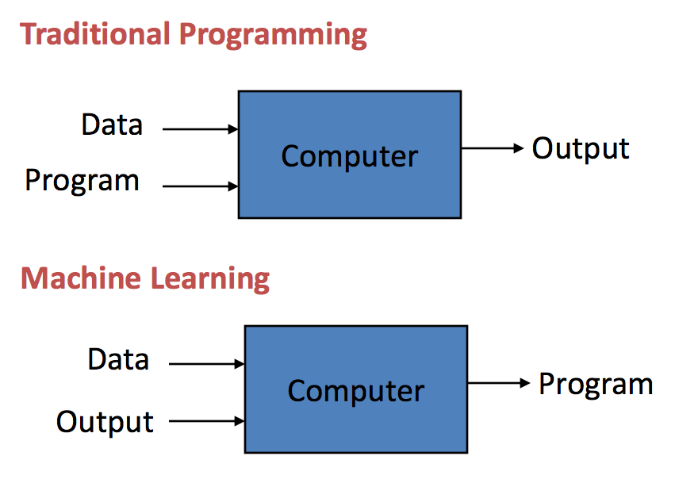

- **Classical computer programming**: humans input the rules and the data, and the computer provides answers.

- **Supervised ML**: humans input the data and the answer, and the computer  learns the rules.

--

## The Machine learning landscape
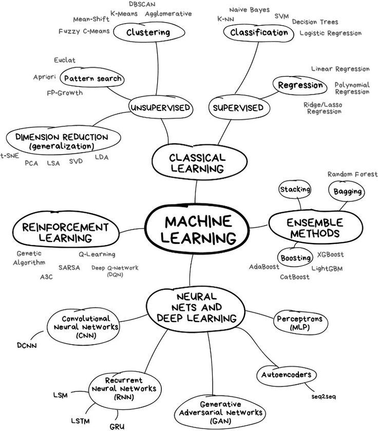

--

## Today

- Focus on regressions

## Not covered

- [Classification](https://malkipp.github.io/big_data_policy_2021/slides/4-classification.htm)

- Advanced ML methods: XGboost [notebook](https://github.com/MalkIPP/big_data_policy_2021/blob/main/notebooks/w8-advanced-ML.ipynb)

- Unsupervised learning [slides](https://malkipp.github.io/big_data_policy_2021/slides/3-unsupervised-learning.html), [notebook](https://github.com/MalkIPP/big_data_policy_2021/blob/main/notebooks/w5-ML-classification.ipynb)

--

### Reference:
- James, G., Witten, D., Hastie, T., Tibshirani, R. (2013). *An Introduction to Statistical Learning.*, [book](https://static1.squarespace.com/static/5ff2adbe3fe4fe33db902812/t/601cc86d7f828c4792e0bcae/1612499080032/ISLR+Seventh+Printing.pdf), chap 3, 6.2

- Géron, A., *Hands-On Machine Learning with Scikit-Learn and TensorFlow*. [book](https://www.knowledgeisle.com/wp-content/uploads/2019/12/2-Aur%C3%A9lien-G%C3%A9ron-Hands-On-Machine-Learning-with-Scikit-Learn-Keras-and-Tensorflow_-Concepts-Tools-and-Techniques-to-Build-Intelligent-Systems-O%E2%80%99Reilly-Media-2019.pdf), chapter 2, and [notebooks](https://github.com/ageron/handson-ml)

---

<!-- .slide: id="accuracy"  -->

# Modeling theory and accuracy measurement
<html>

</html>

Notes:
- Because we care about proposing a model that does good at a prediction task, we want it to be the most **accurate**.

- In order to **evaluate the performance** of a statistical learning method on a given data set, we need some way to measure how well its predictions actually match the observed data

--

## Mean Squared Error (MSE)

`$$MSE= \frac{1}{n} \sum_{i=1}^n (y_i - \hat f(x_i))^2$$`

- **Regression setting**: the <bcolor>mean squared error</bcolor> is a metric of how well a model fits the data.

- But it’s <bcolor>in-sample</bcolor>.  

- What we are really interested in is the <bcolor>out-of-sample</bcolor> fit!

Notes:

MSE will be small if the predicted responses are very close to the true responses,and will be large if for some of the observations, the predicted and true responses differ substantially

--

## Measuring fit (1)

- We would like $(y_0 - \hat f(x_0))^2$ to be small for some $(y_0, x_0)$, not in our <bcolor>training sample</bcolor> $\{(x_i, y_i)\}_{i=1}^n$.

- Assume we had a large set of observations $(y_0, x_0)$ (a <bcolor>test sample</bcolor>),

- then we would like a low
  $$ Ave(y_0 - \hat f(x_0))^2$$

- i.e a low average squared prediction error (<bcolor>test MSE</bcolor>)

--

## Measuring fit (2)

To estimate model fit we need to partition the data:

1. <bcolor>Training set</bcolor>: data used to **fit** the model
  - <bcolor>Training MSE</bcolor>: how well our model fits the training data.
2. <bcolor>Test set</bcolor>: data used to **test the fit**
  - <bcolor>Test MSE</bcolor>: how well our model fits new data

We are most concerned in <bcolor>minimizing test MSE</bcolor>

--

## Training MSE, test MSE and model flexibility

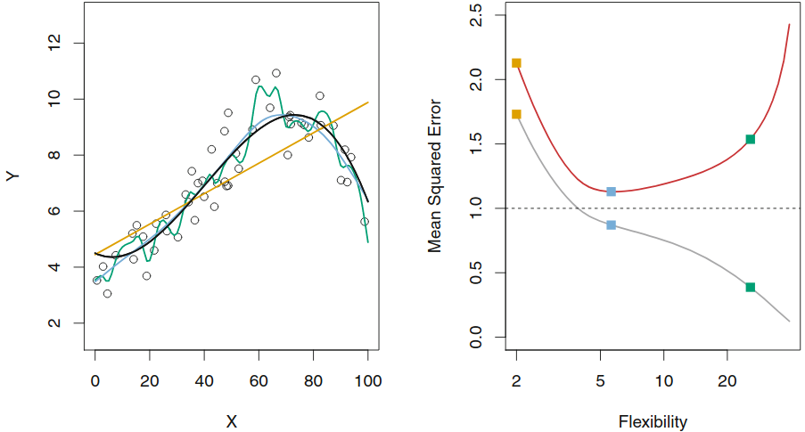
Red (grey) curve is test (train) MSE

Increasing model flexibility tends to <bcolor>decrease</bcolor> training MSE but will eventually <bcolor>increase</bcolor> test MSE

Notes:

- Left:Data simulated from $f$, shown in black.
- Three estimates of $f$ are shown:
    - the linear regression line (orange curve),
    - and two smoothing splinefits (blue and green curves).
- Right:Training MSE (grey curve), test MSE (red curve), and minimum possible test MSE over all methods (dashed line).
- Squares represent the training and test MSEs for the three fits shown in the left-hand panel.

- we observe a monotone decrease in the training MSE and a U-shape in the test MSE

--

## Overfitting

- As model flexibility increases, training MSE will decrease, but the test MSE may not.

- When a given method yields a small training MSE but a large test MSE, we are said to be **overfitting** the data.

- (We almost always expect the training MSE to be smaller than the test MSE)

- Estimating test MSE is important, but requires training data...

---

<!-- .slide: id="train_test"-->
# How to choose training and test set?
<html>

</html>

Notes:
In real life situation, it is generally not possible to explicitly compute the test MSE, bias, or variance for a statistical learning method

They involve repeatedly drawing samples from a training set and refitting a model of interest on each sample in order to obtain additional information about the fitted model

--

## Resamling methods

Estimate the test error rate by

<bcolor>holding out</bcolor> a subset of the training observations from the fitting process,

$+$ then <bcolor>applying</bcolor> the statistical learning method to those held out observations

--

## Validation set approach
- Randomly divide labeled data <bcolor>randomly</bcolor> into two parts: training and test (validation) sets.

 

--

## Two concerns
- Arbitrariness of split
- Only use parts of the data for estimation

  $\rightarrow$ we tend to overestimate test MSE because our estimate of $f(x)$ is less precise

--

## Leave-One-Out Cross-Validation (LOOC)

- Fit on $n−1$ training observations, and a prediction the Last
- Iterate $n$ times
- Assess the average model fit across each test set.

Estimate for the test MSE:
`$$ CV_n=\sum_{i=1}^n MSE_i$$`

--

## Leave-One-Out Cross-Validation (LOOC)

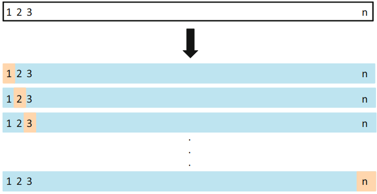 

- less bias than the validation set approach
- always yield the same results
- potentially too expensive to implement

Notes:
- less bias because tends not to overestimate the test error rate as much as the validation set approach does

--

## $k$-fold Cross-validation
- Leave-One-Out Cross-Validation with $k=1$
- Randomly dividing the data into the set of observations into $k$ groups
- 1st fold is treated as a validation set, and the method is fit on the remaining $k−1$ folds
- Iterate $k$ times

Estimate for the test MSE:
`$$ CV_k=\sum_{i=1}^k MSE_i$$`

--

## $k$-fold Cross-validation

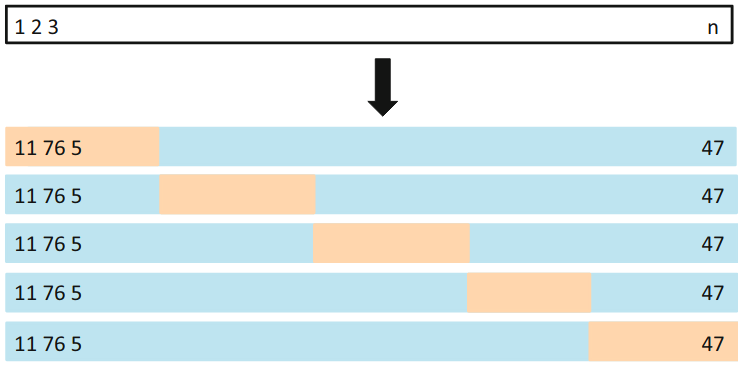 

$\Rightarrow$ Arguably the contribution to econom(etr)ics: Cross-validation (to estimate test MSE)!

---

<!-- .slide: id="linear"-->
# Linear Regression as a Predictive Model
<html>

</html>

--

## Linear Regression

$$Y=\beta_0 + \beta_1 X_1 + \cdots + \beta_p X_p + \epsilon $$

$=$ one of the simplest algorithms for doing supervised learning

A good starting point before studying more complex learning methods

Notes:
Interpretation of $\beta_j$ = the average effect on $Y$ of a unit increase in $X_j$ holding all other predictors fixed

--

## Estimation by Ordinary Least Squares

$RSS=\textrm{Residual sum of squares}=\sum_{i=1}^n (y_i - \hat y_i)^2$

Minimizing RSS gives a <bcolor>closed form solution</bcolor> for the  $\hat \beta_1,\cdots \hat \beta_p$

Most ML models <bcolor>do not</bcolor> have a a closed form solution

--

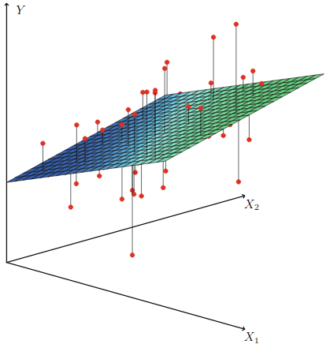

Notes:
In a 3D setting, with two predictors and one response, the least squares regression line becomes a plane.

The plane is chosen to minimize the sum of the squared vertical distances between each observation(shown in red) and the plane

--

## Extensions of the Linear Model

Going further model's assumptions:

- the <bcolor>additive</bcolor>: the effect of changes in a predictor $X_j$ on the response $Y$ is independent of the values of the other predictors

-  <bcolor>linearity</bcolor>: the change in the response $Y$ due to a one-unit change in $X_j$ is constant

--

### Interactions
- Adding interacted variable can help
- Should respect the <bcolor>hierarchy principle</bcolor>:
  - if an interaction is included, the model should always include the main effects as well

Notes:
- Even if the p-value associated with their coef is not significant
- Interactions are hard to interpret without main effects in the model

--

### Non Linearity
- Include transformed versions of the predictors in the model

$\Rightarrow$ Including polynomials in $X$ may provide a better fit

--

## Linear Models: pros and cons
- [Pros]():
  - Interpretability
  - Good predictive performance
  - Accuracy measures for
      - coefficient estimates (standard errors and confidence intervals)
      - the model

- [Cons]():
  - When $p>n$
  - Tend to over-fit training data.
  - Cannot handle multicollinearity.

--

## Generalization of the Linear Models
- <bcolor>Classification problems</bcolor>: logistic regression, support vector machines

- <bcolor>Non-linearity</bcolor>: nearest neighbor methods

- <bcolor>Interactions</bcolor>: Tree-based methods, random forests and boosting

- <bcolor>Regularized fitting</bcolor>: ridge regression and lasso

Notes:
In much of the rest of the class, we discuss methods that expand the scope of linear models and how they are fit:

---

<!-- .slide: id="regularized"  -->
# Regularized Regressions
<html>

</html>

--

## Why Regularization?

- Solution against <bcolor>over-fitting</bcolor>

-  Allow High-Dimensional Predictors
  - $p>>n$: OLS no longer has a unique solution
  - $x_i$ "high-dimensional" i.e. very many regressors
    - pixels on a picture

Notes:
Corollary of regularization:
- Prediction Accuracy:especially when $p > n$, to control the variance

--

## Adding a Regularization Term to the Loss Function $L(.)$

`$$ \hat \beta =arg min_\beta \frac{1}{n} \sum_{i=1}^n L(h(x_i, \beta), y_i) +\lambda R(\beta) $$`

- $R(\beta)$ = <bcolor> regularization  function </bcolor>
  - $R(\beta)=\sum_{i=1}^n p(\beta_i)$ for $p(.)$ the penalty function

- $\lambda$ is a <bcolor>hyperparameter</bcolor> where higher values increase regularization

--

## Different Penalty Functions $p()$
- <bcolor>Ridge (L2)</bcolor>: $p(\beta_j)=\beta_j^2$

- <bcolor>LASSO (L1)</bcolor>: $p(\beta_j)=|\beta_j|$

- <bcolor>Elastic Net</bcolor>: $p(\beta_j)=\alpha |\beta_j| + (1-\alpha) \beta_j^2$

- <bcolor>Subset selection</bcolor>: $p(\beta_j)=1\\{\beta_j\neq 0\\}$

Notes:
- **Ridge**: shrinks coefficients toward zero and helps select between collinear predictors.
- **Lasso** automatically performs feature selection and outputs a sparse model.

--

## How to Solve Without a Closed-form Solution?
### Gradient Descent

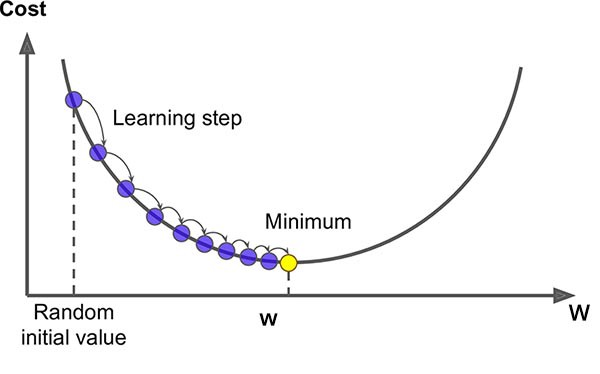

Gradient descent measures the local gradient of the error function, and then steps in that direction.

$\rightarrow$ Minimum in 0

Notes:
- Gradient Descent is a first-order iterative optimization algorithm for finding the local minimum of a differentiable function
  - because it uses the first-order derivative of the loss function to find minima
- Initialize the parameters(weights and bias) randomly.
- In each iteration we move a step in direction of steepest descent
- The size of each step is determined by a parameter which is called Learning Rate

--

## Stochastic Gradient Descent

1. Picks a <bcolor>random instance</bcolor> in the training set

2. Computes the gradient only for that single instance

- [**Pro**](): SGD is much faster to train,

- [**Cons**](): bounces around even after it is close to the minimum.

$\rightarrow$ Compromise: <bcolor>mini-batch gradient descent</bcolor>, selects a sample of rows (a “mini-batch”) for gradient compute

Notes:
- Instead of just randomly sampling one point at each step (SGD), the **“mini-batch”** gradient descent samples a small number of points.
- Mini-batch tries to strike a balance between the goodness of gradient descent and speed of SGD.

--

## Varients of Gradient Descent

--

## Ridge Regression

$min_{\beta} \sum_{i=1}^n (y_i - \hat y_i)^2 + \lambda \sum_{j=1}^p \beta_j^2 $

Where
- $\lambda > 0$ = penalty parameter
- covariates can be high-dimensionnal $p>>N$

Trade-off, from the minimization of the sum of
1. RSS
2. shrinkage penalty: decreases with $\beta_j$

$\rightarrow$ relative importance given by $\lambda$

Notes:
- The tuning parameter $\lambda$ serves to control the relative impact of these two terms on the regression coefficient estimates.
- When $\lambda=0$, the penalty term has no effect, and ridge regression will produce the least squares estimates
- when $\lambda \rightarrow \infty$ : penalty grows and coefficient estimates approach zero

--

## Ridge Regression: shrinkage to $0$
  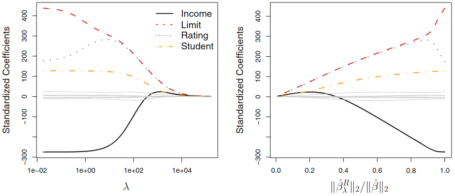

Notes:
Next: Why Does Ridge Regression Improve Over Least Squares?

--

## Ridge: Variance-Bias Trade-Off
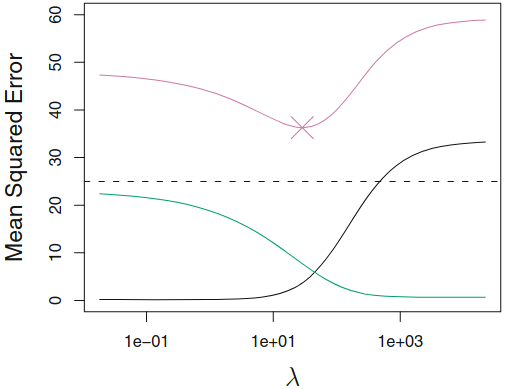

Squared bias (black), variance (green), [test] MSE (red)

Notes:
- As $\lambda$ increases, the flexibility of the ridge regression fit decreases, leading to decreased variance but increased bias
- Up to 10, the variance decreases rapidly, with very little increase in bias
- Beyond this point, the decrease in variance due to increasing $\lambda$ slows, and the shrinkage on the coefficients causes them to be significantly underestimated
- Recall that the test MSE (purple), is a function of the variance plus the squared bias.

--

## Ridge vs. Linear Models

- when outcome and predictors are close to having a linear relationship, the OLS will have low bias but potentially high variance
  - small change in the training data $\rightarrow$ large change in the estimates
  - worse with $p$ close tp $n$
  - if $p>n$, OLS do not have a unique solution

$\rightarrow$ ridge regression works best in situations where the least squares estimates have high variance

--

## LASSO
Overcome an important drawback of Ridge (all $p$ predictors are included in the final model)

LASSO proposes a method to build a model which just <bcolor>includes the most important predictors</bcolor>.

Better for interpretability than Ridge!

Notes:
Ridge: the penalty shinks coefficients toward $0$ but not exactly to $0$

This may not be a problem for prediction accuracy, but it can create a challenge in model interpretation when $p$ is quite large

--

## Lasso Coefficients
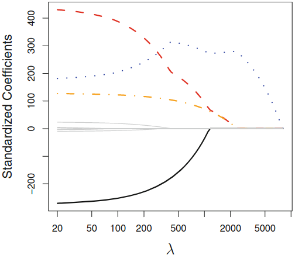

Notes:
- When $\lambda=0$: the lasso simply gives the least squares fit
- when $\lambda$ becomes sufficiently large, the lasso gives the null model in which all coefficient estimates equal 0.
- in between these two extremes, the ridge regression and lasso models are quite different from each other

--

## Lasso: Variance-Bias Trade-Off
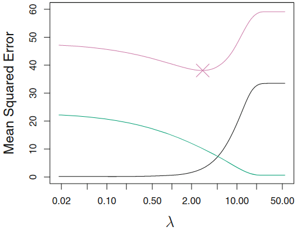

Squared bias (black), variance (green), [test] MSE (red)

--

## Constrained Regression
The minimization problem can be written as follow:

`$$ \sum_{i=1}^n(y_i-x_i'\beta)^2 \textrm{ s.t. } \sum_{j=1}^p p(\beta_j) \leq s,$$`

Where
- Ridge: $\sum_{j=1}^p \beta_j^2 <s $
$\rightarrow$ equation of a <bcolor>circle</bcolor>
- Lasso: $\sum_{j=1}^p |\beta_j| <s $
$\rightarrow$ equation of a <bcolor>diamond</bcolor>

Notes:
- Lasso:  we try to find the set of coefficient estimates that lead to the smallest RSS, subject to the constraint that there is a budgets for how large $\sum_{j=1}^p |\beta_j|$ can be.
- if $s$ is extremely large, it is not very restrictive and the least square solution falls within the budget

--

## Constraint Regions
| Lasso | Ridge|
|:------:|:---:|
|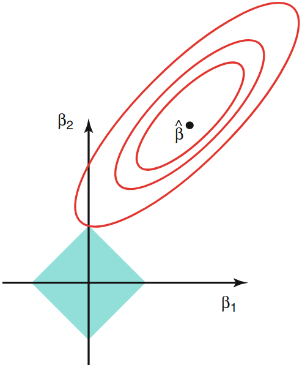 | 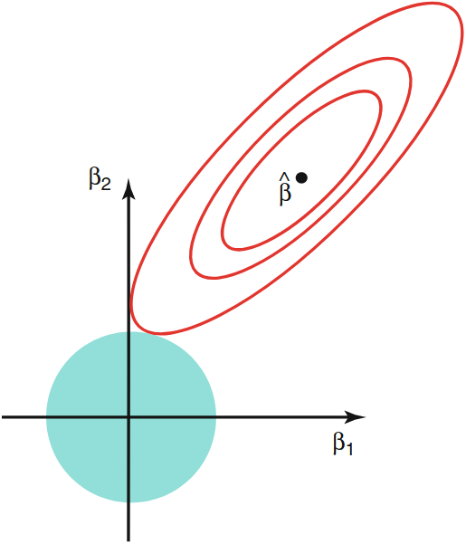 |

Notes:
- Why is it that the lasso, unlike ridge regression, results in coefficient estimates that are exactly equal to zero?
- diamonds & circle represent the ridge & lasso constraint regions
- the red ellipses are the contours of the RSS (for different levels of RSS): regions centered around $\beta$ of constant value of RSS
- $\hat \beta$ is the least square estimate
- the lasso constraint has corners at each of the axes, and so the ellipse will often intersect the constraint region at an axis $\rightarrow$ When this occurs, one of the coefficients will equal zero.

--

## Elastic Net = Lasso + Ridge
$$ MSE(\beta)+\lambda_1 \sum_{j=1}^p |\beta_j| +\lambda_2 \sum_{j=1}^p \beta_j^2$$

$\lambda_1$, $\lambda_2$ $=$ strength of L1 (Lasso) penalty and L2 (Ridge) penalty

--

## Selecting Elastic Net Hyperparameters

- Elastic net <bcolor>hyperparameters</bcolor> should be selected to optimize out-of-sample fit (measured by mean squared error or MSE).

- <bcolor>“Grid search”</bcolor>
  - scans over the hyperparameter space ($\lambda_1 \geq 0, \lambda_2\geq 0$),
  - computes out-of-sample MSE for all pairs $(\lambda_1, \lambda_2)$ ,
  - selects the MSE-minimizing model.

--

## Evaluating Regression Models: $R^2$
MSE is good for comparing regression models, but the units depend on the outcome variable and therefore are not interpretable

Better to use $R^2$ in the test set, which has same ranking as MSE but it <bcolor>more interpretable</bcolor>.

Notes:
$R^2$ proportion of the variance in the dependent variable that is predictable from the independent variable(s)

---

<!-- .slide: id="double_ml"  -->
# ML & Causal Inference
<html>

</html>

--

## Double Machine Learning to Adjust for Confounders

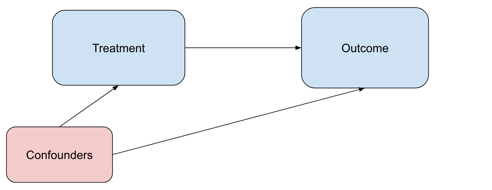

- If the treated group and comparison group differ only by a set of  observable characteristics $\rightarrow$ "control" for these variables to obtain causal estimates.

- But what if we have 1000 covariates?
$\rightarrow$ Machine learning can help.

--

## Double ML: Setup

$$Y=\beta D+g(X)+\epsilon$$

- low-dimensional treatment $D$, high-dimensional set of (observed) confounders $X$.
  - OLS regression without adjusting for confounders will be biased for $\hat{\beta}$
  - can we just include them in the regression as linear covariates?
    - will not adjust correctly due to potential non-linearities.
    - will probably fail to converge due to high dimensionality / collinearity / overfitting

--

## Double ML method

1. Learn $Y$ given $X$, $\hat{Y}(X)$, using any ML method

2. Learn $D$ given $X$, $\hat{D}(X)$, using any ML method

3. Form residuals $\tilde{Y}=Y-\hat{Y}(X)$ and $\tilde{D}=D-\hat{D}(X)$

3.  Regress $\tilde{Y}$ on $\tilde{D}$ to learn $\hat{\beta}$.

--

## Double ML method - Cross-Fitting

Split into samples A and B, 50\% of data each, to prevent overfitting:
- Fit (1) and (2) on sample A, then predict (3) and regress (4) on sample B, to estimate $\hat{\beta}_{A}$
- vice versa: fit (1)/(2) on sample B, and predict/regress (3)/(4) on
sample A, to learn a second estimate for $\hat{\beta}_{B}$.
- average them to get a more efficient estimator:
  $$\hat{\beta}=\\frac{1}{2}(\hat{\beta}_{A}+\hat{\beta}_{B})$$.

---

<!-- .slide: id="final"  -->
# Final Thoughts
<html>

</html>

--

## Selecting the Tuning Parameter By Cross-Validation
1. Choose a <bcolor>grid</bcolor> of $\lambda$ values
2. Compute the <bcolor>CV error</bcolor> for each lambda
3. Select the tuning parameter value for which the CV error is smallest
4. <bcolor>Re-fit</bcolor> the model using all available observation and the best $\lambda$

--

## Data Prep for Machine Learning
- See Geron Chapter 2 for [pandas]() and [sklearn]() syntax:
  - imputing missing values.
  - feature <bcolor>scaling</bcolor> (coefficient size depends on the scaling)
  - <bcolor>encoding</bcolor> categorical variables.

- Best practice
  - <bcolor>reproducible</bcolor> data pipeline
  - <bcolor>standardize</bcolor> coefficients

--

## Other Supervised Machine Learning Methods
- Forward Selection,
- Backward Selection
- Trees and Forests
- Neural Networks
- Boosting
- Ensemble Methods

--

> “Essentially, all models are wrong, but some are useful”
-- George Box
